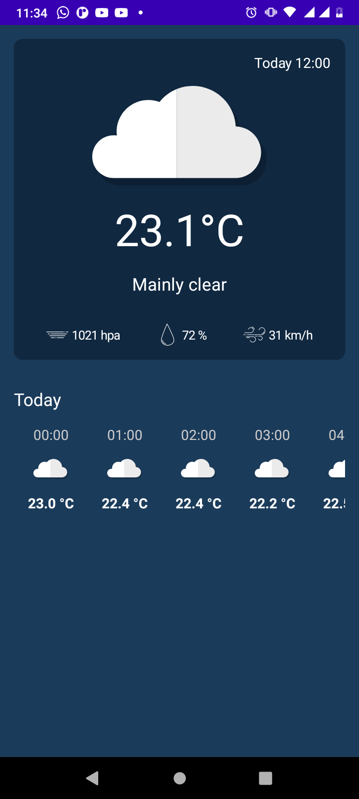

# Projeto Ricky Notas

# Sobre o Projeto
Projeto de estudos para aprender mais sobre técnicas de desenvolvimento Android utilizando Jetpack Compose.O projeto consiste em um app que consume uma api externa grátis para obter dados sobre o clime e mostrar para o usuário os dados.

## Tecnologias Utilizadas
- Dagger
- Retrofit
- Jetpack Compose

# Layout Mobile
## Tela inicial
